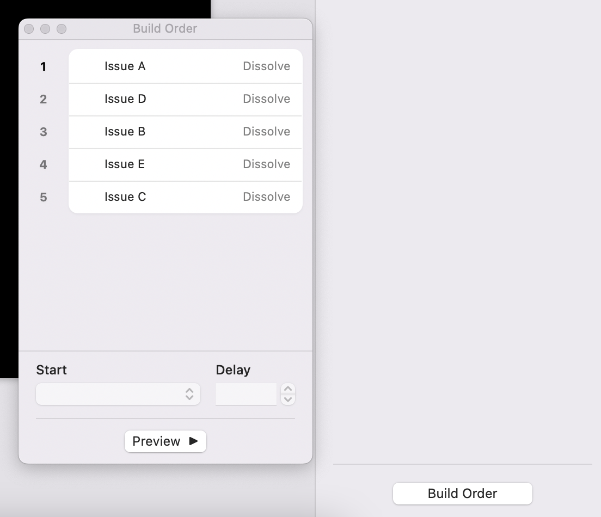
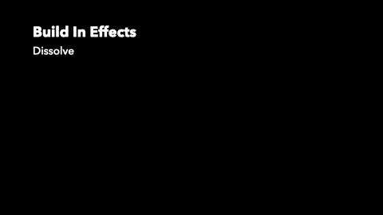
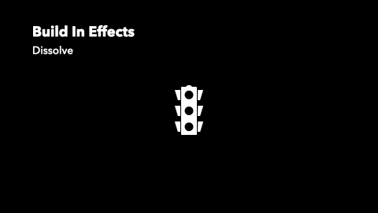
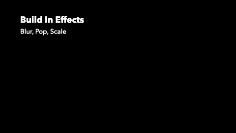

# 构件动画使用实例

恰到好处的动画效果能够更好的服务于演示，希望通过这些实例帮助你更快的找到合适的动画效果，而不是在 Keynote 中一一预览。当然，这里的实例难以覆盖所有实际场景，而通过组合以及细微的调整你也许可以找到更好的解法，这和编写程序有些类似。

***具体动画效果可参考对应文件中的构件顺序与选项***

## 构件出现效果
### [淡入淡出](build-in-effects.key)

罗列观点或个例，也可使用<b>出现</b>代替

模拟现实场景
### [模糊, 弹入, 缩放](build-in-effects.key)

依然是适合罗列观点或个例的效果，但会有更多的强调效果。

*另外缩放效果有多一些自定义选项，适当的调整这些选项可以让你的动画看起来效果更理想。*
