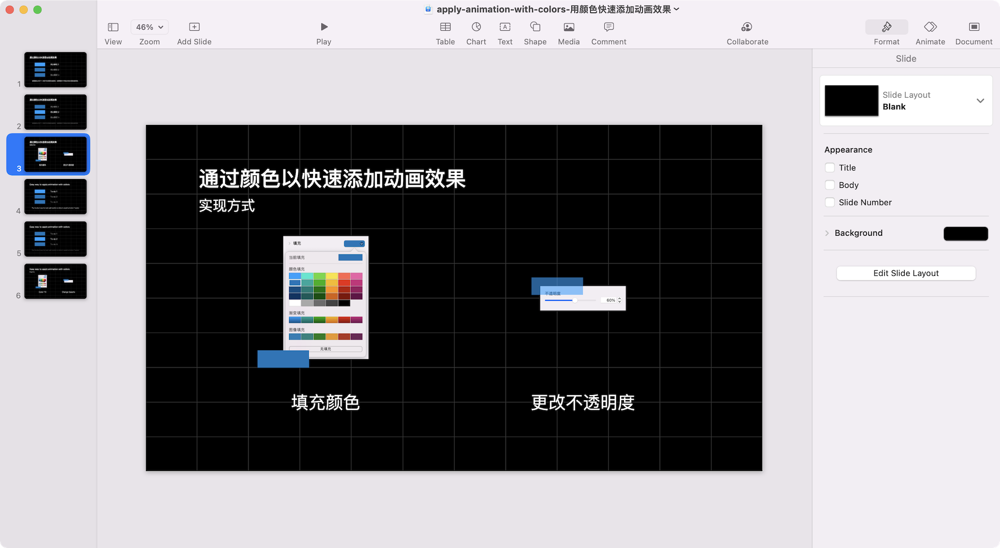

# Keynote-Helper

中文 | [English](README_en.md)

整理了一些自己使用 Keynote 的方法和窍门，主要包含排版、构件、动画这些内容。其中的项目文件可以直接添加至你的文件当中，关于构件和动画的使用方式会有单独的说明，我会慢慢补充。希望这个项目可以在你制作 Keynote 时提供一些帮助。

## 示例
### [排版](Layout-排版)

利用简单的排版规则让页面千变万化。

### [构件](Object-构件)

帮助你充分发挥 Keynote 中构件的作用。

### [动画](Animation-动画)

包含一些容易上手且效果不错的动画技巧和模版，可以帮助提高效率和内容表达。

## 使用简介(暂时)
* 添加项目到本地

`git clone https://github.com/monswag/Keynote-Helper.git`
或使用 [Github Desktop](https://desktop.github.com) 添加

* 在 Keynote 中插入模版幻灯片

