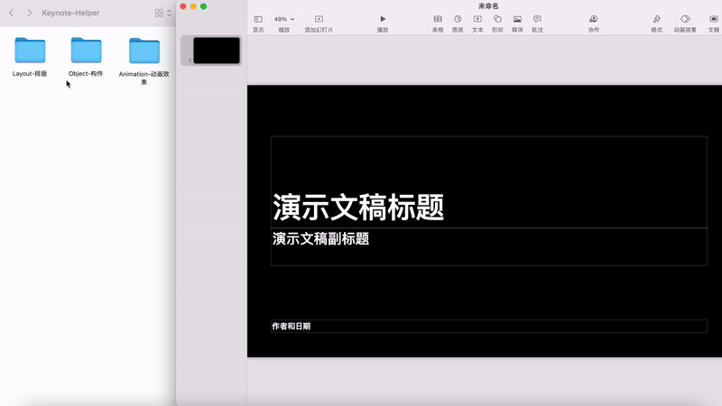

# Keynote-Helper

[中文](README.md) | English

There are some tips I grasped when using Keynote, which include layout, objects and animation. You can merge the file into your project, I'm planning to make a full instruction for objects and animation later. I hope this project could help you find it easier with Keynote.

## Example
#### Layout

Build varied slices with simple layout rules.

#### Object

Master your skill to play with object in Keynote.

#### Animation

Including handy animation applying tips and templates that help you with content expression.

## Wiki(temp)

* Clone to local

`git clone https://github.com/monswag/Keynote-Helper.git`
or open with [Github Desktop](https://desktop.github.com)

* Embed a slide from templates in Keynote

